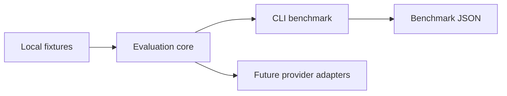

# #30 cost-aware-inference

**Claim:** Cost-aware inference comparator that reports local vs API token cost and latency side by side without paid credentials.

**Benchmark:** `api_cost_per_1k_tokens_usd` = `0.0007` on local deterministic fixtures. Result file: `benchmarks/results/cost-aware-baseline.json`.

## What It Proves

This repository is part of **AI Evaluation and Retrieval Systems**. It provides one measurable layer of the AI Evaluation & RAG Platform while keeping the default path local-first, Dockerized, and free of paid credentials.

## Architecture



Dependency rule: evaluation core does not import provider SDKs, cloud SDKs, web frameworks, or GitHub automation.

## Run Locally

```powershell
$env:PYTHONPATH = "src"
python -m cost_aware_inference benchmark --output benchmarks/results/cost-aware-baseline.json
```

## Run With Docker

```powershell
docker build -t cost-aware-inference .
docker run --rm cost-aware-inference
```

## Benchmark Result

See `benchmarks/results/cost-aware-baseline.json`.

## Reuse Contract

- Uses `portfolio-reuse-kit` for agent graph, SDD, validation, design system, and publication gate.
- Records reusable improvement decisions in `sdd/reuse-improvement-review.md`.
- Runs without paid secrets by default.
