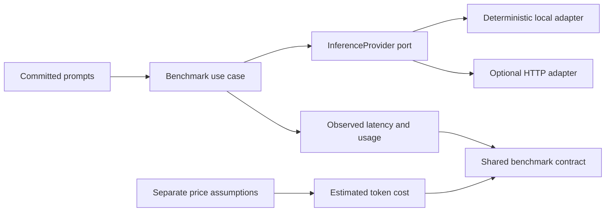

# #30 cost-aware-inference

**Measured baseline:** `1.2246 ms` observed p95 latency across 15 local calls. The recorded `US$ 0` is a pricing assumption for marginal API token fees, not a claim of zero compute cost. Evidence: `benchmarks/results/cost-aware-baseline.json`.

## What This Proves

This repository executes a deterministic local text-inference baseline, measures wall-clock latency and token usage per request, and applies pricing assumptions afterward. It also provides an optional OpenAI-compatible HTTP adapter so a real endpoint can be measured with the same result contract.

The local adapter is an extractive frequency-weighted baseline, **not an LLM**. The committed benchmark does not claim model quality or local-versus-API superiority because no external provider was called.

## Reproduce The Number

```powershell
$env:PYTHONPATH = "src"
python -m cost_aware_inference benchmark --providers local --repeat 5 --output benchmarks/results/cost-aware-baseline.json
python tools/validate-benchmark.py benchmarks/results/cost-aware-baseline.json
```

## Docker

```powershell
docker build -t cost-aware-inference .
docker run --rm cost-aware-inference
```

The image runs as a non-root user and uses only committed fixtures and pricing assumptions on its default path.

## Optional HTTP Comparison

The HTTP adapter has no URL, model, price, or secret fallback. Configure it only through the environment:

```powershell
$env:CAI_HTTP_BASE_URL = "http://localhost:11434/v1"
$env:CAI_HTTP_MODEL = "your-model"
$env:CAI_HTTP_PROVIDER_ID = "local-openai-compatible"
$env:CAI_HTTP_INPUT_PRICE_PER_1M_USD = "0"
$env:CAI_HTTP_OUTPUT_PRICE_PER_1M_USD = "0"
$env:CAI_HTTP_PRICE_SOURCE = "local endpoint; no token tariff"
# Set CAI_HTTP_API_KEY only when the endpoint requires it.
python -m cost_aware_inference benchmark --providers local,http --repeat 5 --output benchmarks/results/comparison.json
```

Tests inject a fake transport; they never open a network connection.

## Measurement Contract

| Field | Meaning |
|---|---|
| `observed_latency_ms` | Wall-clock duration around one provider call. |
| `input_tokens`, `output_tokens` | Adapter-reported usage. The local adapter uses a documented regex tokenizer. |
| `pricing_assumption` | Separately configured prices, source, currency, and scope. |
| `estimated_cost_usd` | Observed token counts multiplied by the pricing assumption. |
| `output_sha256` | Output identity without publishing full responses. |

The root object implements the shared portfolio fields `project`, `metric`, `value`, `unit`, `timestamp`, `command`, `repeat`, `samples`, `summary`, and `environment`. Each provider also emits its own measured totals and samples.

## Architecture



Dependency rule: the application depends on the provider protocol and domain values. HTTP, CLI, fixtures, and pricing files remain outer adapters.

## Current Evidence

| Provider | Workload | Samples | Observed p95 | Observed tokens | Estimated token charge |
|---|---|---:|---:|---:|---:|
| `local-extractive-v1` | deterministic extractive text processing | 15 | 1.2246 ms | 640 | US$ 0.00* |

\*The local price assumption excludes hardware, electricity, and operations. Latency varies by host; rerun before making a deployment decision.

## Quality Gates

```powershell
$env:PYTHONPATH = "src"
python -m unittest discover -s tests -v
pwsh -File tools/validate-project.ps1 -SkipDocker
```

## Reuse Contract

- Uses the portfolio shared benchmark fields and records provider-level samples.
- Keeps provider replacement behind a narrow port, applying DIP, OCP, and LSP without framework coupling.
- Keeps secrets out of files and benchmark output.
- Records continuation state in `sdd/agent-handoff.md`.
