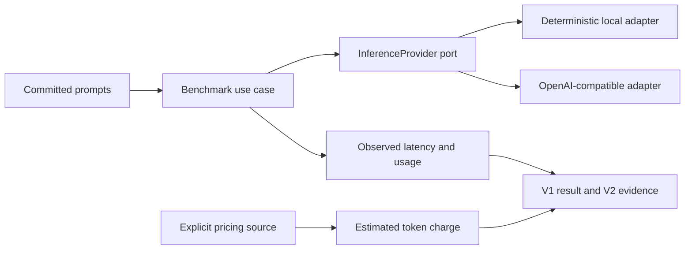

# #30 cost-aware-inference

**Measured baseline:** `0.1629 ms` observed p95 across `15` local calls and `640` observed tokens. The `US$ 0.00` token charge is a pricing assumption, not zero infrastructure cost.

**Claim:** A local-first benchmark that executes provider work, records latency and token usage, and applies explicit pricing assumptions through provider-neutral ports.

## What It Proves

The default path runs deterministic extractive text processing, records every call, and hashes outputs. The local adapter is **not an LLM**. It exists as a credential-free reference workload for the cost and measurement contract.

An OpenAI-compatible adapter can execute the same requests against Ollama, Kumo-backed local services, or a configured cloud endpoint. No external provider is called in the committed baseline, so this repository does not publish a fabricated local-versus-API winner.

## Benchmark Evidence

| Measure | Result |
|---|---:|
| Provider | `local-extractive-v1` |
| Observed p95 latency | `0.1629 ms` |
| Workload | `3 prompts x 5 repetitions` |
| Measured calls | `15` |
| Observed tokens | `640` |
| Estimated token charge | `US$ 0.00` |
| Provider comparison | `not available` |

Latency is host-specific. The local pricing scope excludes hardware, electricity, and operations. Rerun on the target host before making a deployment decision.

## Run

```powershell
$env:PYTHONPATH = "src"
python -m cost_aware_inference benchmark --providers local --repeat 5 --output benchmarks/results/cost-aware-baseline.json
python tools/validate-benchmark.py benchmarks/results/cost-aware-baseline.json
```

```powershell
docker build -t cost-aware-inference .
docker run --rm --network none cost-aware-inference
```

The image is version-and-digest pinned, runs as UID `10001`, and needs no network or credentials on its default path.

## Real Provider Comparison

Configure a real OpenAI-compatible endpoint only through environment variables:

```powershell
$env:CAI_HTTP_BASE_URL = "http://localhost:11434/v1"
$env:CAI_HTTP_MODEL = "your-model"
$env:CAI_HTTP_PROVIDER_ID = "local-openai-compatible"
$env:CAI_HTTP_INPUT_PRICE_PER_1M_USD = "0"
$env:CAI_HTTP_OUTPUT_PRICE_PER_1M_USD = "0"
$env:CAI_HTTP_PRICE_SOURCE = "local endpoint; no token tariff"
python -m cost_aware_inference benchmark --providers local,http --repeat 5 --output benchmarks/results/comparison.json
```

Set `CAI_HTTP_API_KEY` only when the endpoint requires it. The adapter has no URL, model, tariff, or secret fallback. Tests inject transport and never open a network connection.

## Measurement Contract

| Field | Meaning |
|---|---|
| `observed_latency_ms` | Wall-clock duration around one provider call. |
| `input_tokens`, `output_tokens` | Adapter-reported usage; the local adapter uses a documented regex tokenizer. |
| `pricing_assumption` | Configured price, source, currency, and scope. |
| `estimated_cost_usd` | Observed token counts multiplied by the pricing assumption. |
| `output_sha256` | Output identity without publishing response content. |
| `repeat` | Workload repetitions per input request. |
| `measured_iterations` | Calls measured for the primary provider. |

## Architecture


```mermaid
flowchart LR
  Requests["Committed prompts"] --> Runner["Benchmark use case"]
  Runner --> Port["InferenceProvider port"]
  Port --> Local["Deterministic local adapter"]
  Port --> HTTP["OpenAI-compatible adapter"]
  Runner --> Measured["Observed latency and usage"]
  Pricing["Explicit pricing source"] --> Estimate["Estimated token charge"]
  Measured --> Result["V1 result and V2 evidence"]
  Estimate --> Result
```

The application depends on `InferenceProvider`, not HTTP infrastructure. Provider execution and pricing vary independently, keeping SRP, OCP, LSP, ISP, and DIP concrete rather than decorative.

## Validate

```powershell
python -m unittest discover -s tests -v
./tools/validate-project.ps1
```

The raw result is `benchmarks/results/cost-aware-baseline.json`. Publication adds `benchmarks/publication/cost-aware-baseline-v2.json`, binding the measurement to the clean source commit, exact Docker image, committed data, benchmark config, and validation lock.