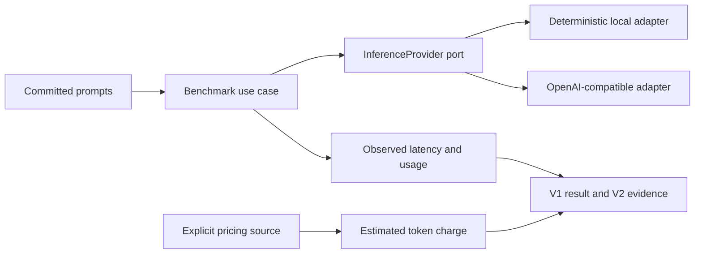

# #30 cost-aware-inference

**Publication workload:** pinned `qwen2.5-coder:0.5b` over local Ollama HTTP versus the explicitly non-LLM in-process reference, with `60` measured calls after warm-up. Exact p95 comes only from the committed V2 execution.

**Claim:** A local-first benchmark that compares a real, digest-pinned LLM behind an OpenAI-compatible API with a deterministic non-LLM reference, recording latency, usage, failures, and explicit pricing assumptions.

## What It Proves

The publication path runs a real local model through Ollama. The deterministic adapter remains **not an LLM** and exists only as a low-overhead reference for the same measurement contract.

The same HTTP port can target Ollama, a Kumo-backed local service, or a configured cloud endpoint. This publication compares local Ollama HTTP with the in-process reference; it does not claim cloud pricing or cloud latency.

## Benchmark Evidence

| Measure | Result |
|---|---:|
| Primary provider | `ollama-qwen2.5-coder-0.5b` |
| Model digest | `sha256:4ff64a7f...3fb09` |
| Workload | `3 prompts x 10 repetitions x 2 providers` |
| Measured calls | `60` |
| Estimated token charge | `US$ 0.00` |
| Warm-up | `1 call per provider`, excluded |

Latency is host-specific. The local pricing scope excludes hardware, electricity, and operations. Rerun on the target host before making a deployment decision.

## Run

```powershell
$env:PYTHONPATH = "src"
python -m cost_aware_inference benchmark --providers local --repeat 5 --output benchmarks/results/local-reference.json
python tools/validate-benchmark.py benchmarks/results/cost-aware-baseline.json
```

```powershell
docker build -t cost-aware-inference .
docker run --rm --network none cost-aware-inference
```

The image is version-and-digest pinned, runs as UID `10001`, and needs no network or credentials on its default path.

## Real Local LLM Comparison

Configure a real OpenAI-compatible endpoint only through environment variables:

```powershell
$env:CAI_HTTP_BASE_URL = "http://localhost:11434/v1"
$env:CAI_HTTP_MODEL = "qwen2.5-coder:0.5b"
$env:CAI_HTTP_MODEL_DIGEST = "sha256:4ff64a7f502a08b7616edb8ca0a79eb1853fc363d842b7df4b46915d11a3fb09"
$env:CAI_HTTP_PROVIDER_ID = "ollama-qwen2.5-coder-0.5b"
$env:CAI_HTTP_ENDPOINT_KIND = "local-ollama"
$env:CAI_HTTP_INPUT_PRICE_PER_1M_USD = "0"
$env:CAI_HTTP_OUTPUT_PRICE_PER_1M_USD = "0"
$env:CAI_HTTP_PRICE_SOURCE = "local endpoint; no token tariff"
python -m cost_aware_inference benchmark --providers http,local --repeat 10 --warmup 1 --output benchmarks/results/comparison.json
```

Set `CAI_HTTP_API_KEY` only when the endpoint requires it. The adapter has no URL, model, tariff, or secret fallback. Tests inject transport and never open a network connection.

## Measurement Contract

| Field | Meaning |
|---|---|
| `observed_latency_ms` | Wall-clock duration around one provider call. |
| `input_tokens`, `output_tokens` | Adapter-reported usage; the local adapter uses a documented regex tokenizer. |
| `pricing_assumption` | Configured price, source, currency, and scope. |
| `estimated_cost_usd` | Observed token counts multiplied by the pricing assumption. |
| `output_sha256` | Output identity without publishing response content. |
| `repeat` | Workload repetitions per input request. |
| `measured_iterations` | Calls measured across every provider. |
| `failure_count` | Provider errors retained as evidence; publication requires zero. |

## Architecture


```mermaid
flowchart LR
  Requests["Committed prompts"] --> Runner["Benchmark use case"]
  Runner --> Port["InferenceProvider port"]
  Port --> Local["Deterministic local adapter"]
  Port --> HTTP["OpenAI-compatible adapter"]
  Runner --> Measured["Observed latency and usage"]
  Pricing["Explicit pricing source"] --> Estimate["Estimated token charge"]
  Measured --> Result["V1 result and V2 evidence"]
  Estimate --> Result
```

The application depends on `InferenceProvider`, not HTTP infrastructure. Provider execution and pricing vary independently, keeping SRP, OCP, LSP, ISP, and DIP concrete rather than decorative.

## Validate

```powershell
python -m unittest discover -s tests -v
./tools/validate-project.ps1
```

The raw result is `benchmarks/results/cost-aware-baseline.json`. Published evidence is `benchmarks/publication/cost-aware-baseline-v2.json`, binding the measurement to the clean source commit, exact Docker image, committed data, benchmark config, and validation lock.
