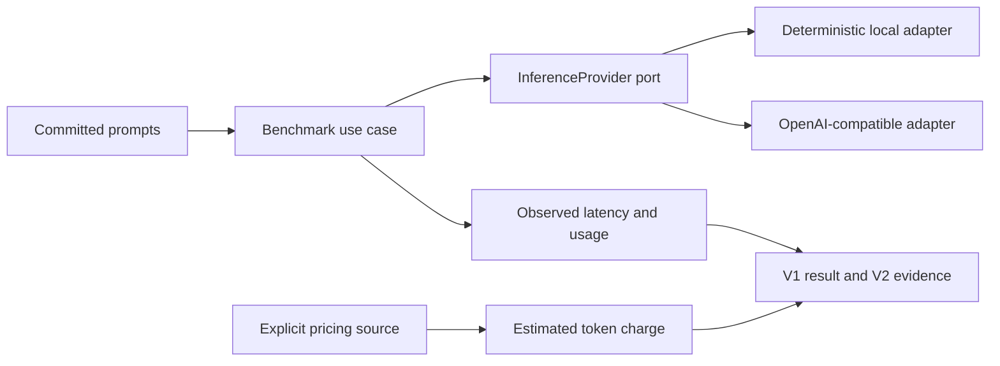

# Cost-Aware Inference: One Measurement Contract for Latency, Tokens, and Price

**A digest-pinned `qwen2.5-coder:0.5b` behind a local OpenAI-compatible endpoint reached p95 `1011.015 ms`** across `60` measured calls with zero failures, with token usage and an explicit pricing assumption recorded for every call. The same port targets local or hosted endpoints by configuration only.

[](https://github.com/Brilhante29/cost-aware-inference/actions/workflows/validate.yml)
[](LICENSE)


## Why this exists

"Which model should we use?" is a cost question as much as a quality question, and it is usually answered with list prices and guesses. Teams compare a hosted API with a local model without measuring both through the same code path, and the pricing assumption behind the spreadsheet lives in someone's head. This repository makes the comparison explicit:

- every provider implements one `InferenceProvider` port; the benchmark never imports HTTP code;
- each call records wall-clock latency, adapter-reported tokens, a hash of the output, and the pricing assumption used (price, source, currency, scope);
- cost is computed as observed tokens times the configured tariff, and the adapter has no URL, model, tariff, or secret fallback;
- provider failures are retained as evidence, and publication requires zero.

## Results

| Measure | Result |
|---|---:|
| Primary provider | `ollama-qwen2.5-coder-0.5b` |
| Model digest | `sha256:4ff64a7f...3fb09` |
| LLM observed p95 | `1011.015 ms` |
| In-process reference p95 | `0.240 ms` |
| Workload | `3 prompts x 10 repetitions x 2 providers` |
| Measured calls | `60` |
| LLM observed tokens | `2660` |
| Provider failures | `0` |
| Estimated token charge | `US$ 0.00` |
| Warm-up | `1 call per provider`, excluded |

**How to read it:** the in-process reference is **not an LLM**. It is a deterministic adapter that goes through the same measurement contract, so its `0.240 ms` p95 is the floor of harness overhead; the roughly `4213.51x` gap shows the harness adds negligible noise to a real model call. The `US$ 0.00` charge reflects a local endpoint with no token tariff; hardware, electricity, and operations are explicitly out of scope. Latency is host-specific, so rerun on the target host before deciding.

## Quickstart

```bash
docker build -t cost-aware-inference .
docker run --rm --network none cost-aware-inference
```

The image is version- and digest-pinned, runs as UID `10001`, and needs no network or credentials on its default path.

Compare a real endpoint (configuration only through environment variables):

```bash
export CAI_HTTP_BASE_URL=http://localhost:11434/v1
export CAI_HTTP_MODEL=qwen2.5-coder:0.5b
export CAI_HTTP_MODEL_DIGEST=sha256:4ff64a7f502a08b7616edb8ca0a79eb1853fc363d842b7df4b46915d11a3fb09
export CAI_HTTP_PROVIDER_ID=ollama-qwen2.5-coder-0.5b
export CAI_HTTP_ENDPOINT_KIND=local-ollama
export CAI_HTTP_INPUT_PRICE_PER_1M_USD=0
export CAI_HTTP_OUTPUT_PRICE_PER_1M_USD=0
export CAI_HTTP_PRICE_SOURCE="local endpoint; no token tariff"
PYTHONPATH=src python -m cost_aware_inference benchmark --providers http,local --repeat 10 --warmup 1 \
  --output benchmarks/results/comparison.json
```

Set `CAI_HTTP_API_KEY` only when the endpoint requires it. For a hosted model, set its real tariff and source; the result then carries that assumption with the number.

## Measurement contract

| Field | Meaning |
|---|---|
| `observed_latency_ms` | Wall-clock duration around one provider call |
| `input_tokens`, `output_tokens` | Adapter-reported usage; the local adapter uses a documented regex tokenizer |
| `pricing_assumption` | Configured price, source, currency, and scope |
| `estimated_cost_usd` | Observed tokens multiplied by the pricing assumption |
| `output_sha256` | Output identity without publishing response content |
| `repeat`, `measured_iterations` | Repetitions per request and calls measured across providers |
| `failure_count` | Provider errors retained as evidence |

## How it works


```mermaid
flowchart LR
  Requests["Committed prompts"] --> Runner["Benchmark use case"]
  Runner --> Port["InferenceProvider port"]
  Port --> Local["Deterministic local adapter"]
  Port --> HTTP["OpenAI-compatible adapter"]
  Runner --> Measured["Observed latency and usage"]
  Pricing["Explicit pricing source"] --> Estimate["Estimated token charge"]
  Measured --> Result["V1 result and V2 evidence"]
  Estimate --> Result
```

Provider execution and pricing vary independently: a new endpoint is a new adapter, a new tariff is new configuration.

## Design decisions

| Decision | Why | Rejected |
|---|---|---|
| One port for every provider | Local and hosted calls are measured by identical code | Separate scripts per vendor |
| Pricing as explicit, sourced configuration | The assumption travels with the number | Hard-coded list prices |
| No fallbacks for URL, model, tariff, or secret | Misconfiguration fails loudly instead of measuring the wrong thing | Silent defaults |
| Tests inject transport | The suite never opens a network connection | Live calls in unit tests |

## Limitations

- Three prompts; enough to validate the contract, not to profile a model across workloads.
- CPU host timing only; GPU and hosted-endpoint latency are not part of this publication.
- Token-tariff cost only; infrastructure cost needs a separate model.

## Reproducibility

- Raw result: [`benchmarks/results/cost-aware-baseline.json`](benchmarks/results/cost-aware-baseline.json).
- Published evidence (clean source commit, exact image, committed data, config, lock): [`benchmarks/publication/cost-aware-baseline-v2.json`](benchmarks/publication/cost-aware-baseline-v2.json).

## Project structure

```text
src/cost_aware_inference/   benchmark use case, adapters (local, OpenAI-compatible), CLI
tests/                      contract, pricing, and adapter tests with injected transport
data/                       committed prompts and pricing assumptions
benchmarks/                 raw results and V2 publication evidence
tools/                      benchmark and publication validators
sdd/  openspec/             specification, architecture and technical decisions
```

## How this repository is built

The project follows the spec-driven workflow of [portfolio-reuse-kit](https://github.com/Brilhante29/portfolio-reuse-kit). Requirements and decisions live in [`sdd/`](sdd) and [`openspec/`](openspec), and [`project.yaml`](project.yaml) records the architecture, stack, and rejected alternatives. Development is AI-assisted and human-governed: [`AGENTS.md`](AGENTS.md) and [`CLAUDE.md`](CLAUDE.md) hold the coding-agent instructions, while tests, validators, and CI decide what gets published.

## Related work

- [prompt-ab-testing](https://github.com/Brilhante29/prompt-ab-testing) and [llm-agent-eval](https://github.com/Brilhante29/llm-agent-eval): the same local model evaluated for quality.
- [mini-aws-emulator](https://github.com/Brilhante29/mini-aws-emulator): the local-first approach to cloud dependencies.

See [`REFERENCES.md`](REFERENCES.md) for attribution.

## Author

**Guilherme Brilhante**, software engineer working on scalable backends and production AI.
[LinkedIn](https://www.linkedin.com/in/guilhermefreirebrilhanteseveriano/) · [GitHub](https://github.com/Brilhante29) · [Publications](https://dblp.org/pid/353/6812.html)

## License

[MIT](LICENSE).
